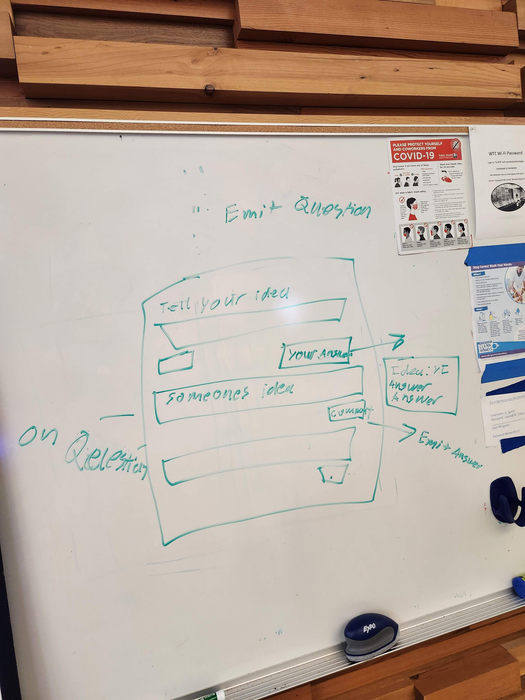

# KBW Frontend

## Overview

This is the frontend for a our group project. We are applying code to interact with the backend to have clients interact via sockets. Features Socket.IO.

## Live Deploy

[Netlify](https://kbw.netlify.app/)

## Deployment

How do I install the app or library?
Clone this app and install all dependencies.

How do I test the app or library?
Run "NPM test" in the terminal once all dependencies are installed.

For Applications:
How do I run the app?
You can run the app on your local terminal.
How do I set up the app?
Be sure to install all dependencies.

## Testing

Liberal use of console logs to track errors.

## Documentation

## Contributions
